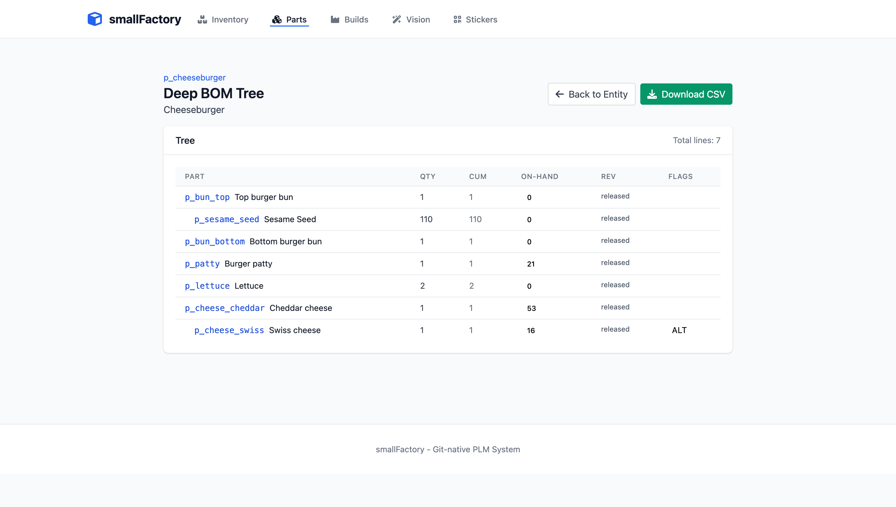
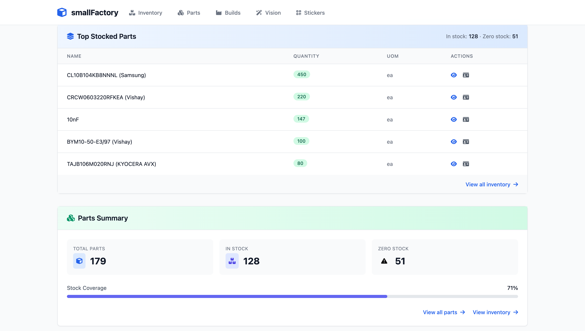
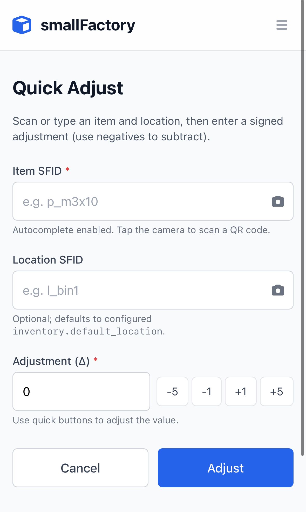
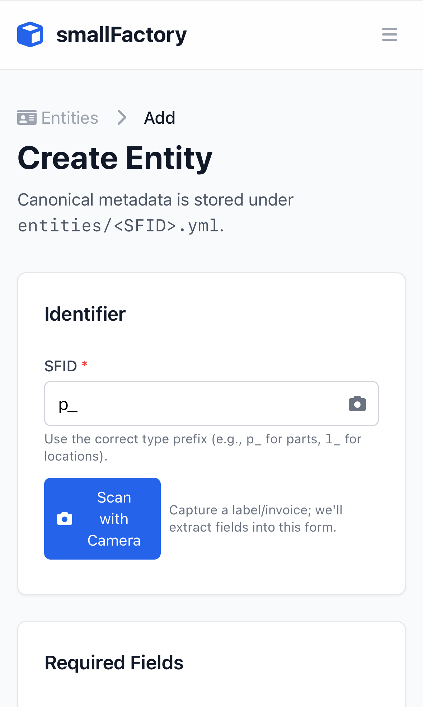
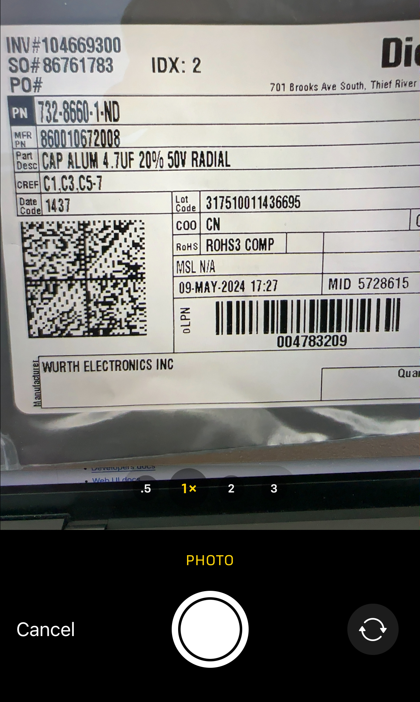
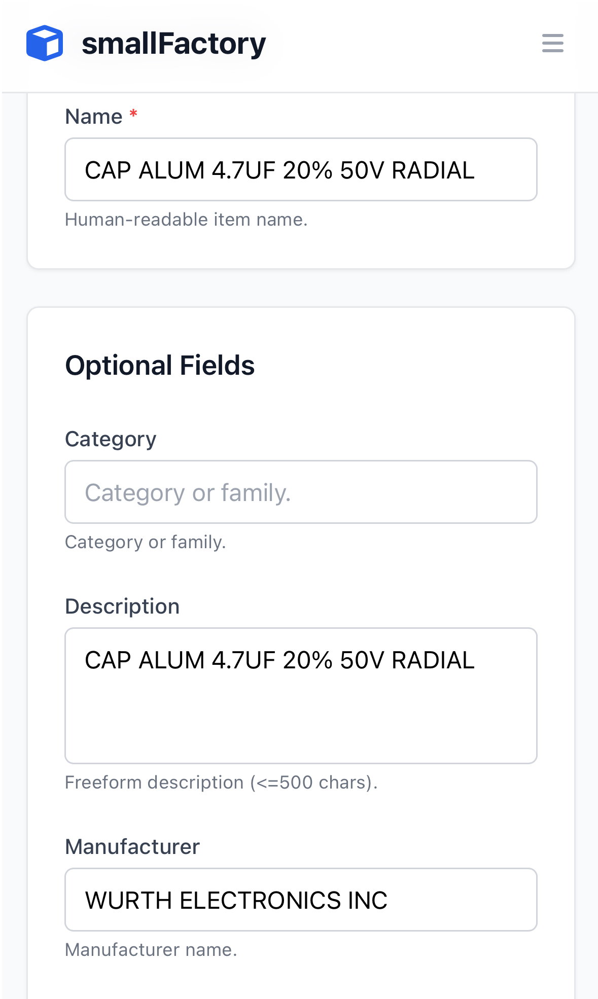

# smallFactory

[](https://github.com/yusufm/smallfactory/stargazers)
[](https://github.com/yusufm/smallfactory/blob/main/LICENSE)
[](https://github.com/yusufm/smallfactory/commits/main)

**For solo founders and tiny hardware teams who are tired of spreadsheet chaos but don't need enterprise PLM.**


## What is smallFactory

A Git-native toolset for small teams to manage the things they make.

- Design
  - Manage part/assembly metadata, drawings/CAD/notes files, BOMs, etc.
- Snapshot
  - 1-click revision control of parts.
- Build
  - Track built parts, serial numbers, test results, photos, etc.
  - Manage inventory.

## Why smallFactory

Read the [smallFactory Story](docs/meta/the-smallfactory-story.md)

- Built for small teams: minimal setup, low overhead, fast workflows.
- Git-native and portable: plain files under Git; diffs, reviews, history. No database, no lock‑in.
- Opinionated, simple standard: Entities, BOMs, Revisions, Inventory, Files in a consistent layout.
- Tools that fit your flow: CLI and lightweight web UI; human/JSON/YAML output; commits locally, pushes if origin exists.
- Extensible by design: readable YAML/JSON so you can script, automate, and integrate.

## Prefer turnkey? smallFactory Cloud (Fully Managed)

Want everything smallFactory offers without running servers? smallFactory Cloud is our fully managed, multi-tenant hosting—so you can focus on building, not babysitting infrastructure.

Get started: https://www.exploresf.com

## Quickstart

Get up and running with smallFactory inventory management in a few simple steps:

```sh
# Setup (once)
# Prereqs: Python 3 and Git installed
# Clone the smallFactory core repo
$ git clone https://github.com/yusufm/smallfactory.git smallfactory
$ cd smallfactory

# Optional: create and activate a virtual environment
$ python3 -m venv .venv && source .venv/bin/activate

# Install CLI dependencies
$ python3 -m pip install -r requirements.txt
# Optional: Web UI dependencies (if you plan to run the web app)
$ python3 -m pip install -r web/requirements.txt

# Initialize by cloning the example datarepo
# 1. Fork the sample data repository on GitHub by going to this URL (or through the fork button on the sample repo):
https://github.com/yusufm/smallfactory_test_datarepo/fork
# 2. Clone using YOUR fork of the sample data repo
$ python3 sf.py init --github-url git@github.com:<YOUR-USERNAME-HERE>/smallfactory_test_datarepo.git

# Start the web server
$ python3 sf.py web

# Access the web UI
http://127.0.0.1:8080

# Note: All mutating CLI operations automatically create a Git commit (and push if an origin exists).
# Commit messages include machine-readable tokens like ::sfid::<SFID>.
```

## Community

Join the smallFactory Discord:
https://discord.gg/g3QSuVmvBt

## Features at a glance

### Design
- **Entities** — Organize parts, assemblies, and locations with names, tags, and metadata.
- **Files workspace** — Upload, organize, and download design files and documents; snapshots captured in revisions.
- **BOM** — Manage bills of materials with alternates; edit in the app; see structure at a glance.




### Build & release
- **Revisions** — One‑click, numbered revisions with clear release tracking.
- **Stickers** — Generate QR stickers for parts and locations; print in batches with chosen fields.
- **Camera capture** — Snap a photo of an invoice or label to auto‑extract parts data.
- **Vision‑assisted intake** — Extract parts from invoices and batch‑create with review.


### Operate
- **Inventory** — Track quantities by location; adjust quickly with mobile QR scanning.
- **Mobile access** — Optimized for phones with simple, touch‑first flows.
- **Search & dashboard** — Find parts fast and see key stats at a glance.
- **QR‑first workflows** — Label, scan, and act quickly on the floor.


<p>
  
  
</p>

### Vision
Use a camera or upload to extract parts from invoices and batch-create entities.

<p>
  
  
  
</p>

### Platform
- **Git‑native workflow** — Your product data lives in Git. Simple, transparent, and portable.
- **Collaboration & history** — Work as a team with reviewable changes and a full history.
- **Local‑first** — Runs on your machine; you control your data and workflow; automatically updates your remote Git repo when configured.
- **Web UI** — Fast, clean, responsive interface with search and inline editing.
- **CLI** — Powerful command‑line for automation; human‑ or machine‑readable output.
- **Validation** — Built‑in checks to catch mistakes early.
- **Custom fields & tags** — Capture the details that matter to your business.
- **Simple onboarding** — Start in minutes with an example repository.

## GET endpoints are pure (no side effects)

- All HTTP GET routes avoid cache writes and Git mutations.
- Inventory reads in the web app use the read‑only helper `inventory_onhand_readonly()`.
- CLI parity: use `sf inventory onhand --readonly` to compute on‑hand without writing caches.

---

## What to read next
- [The smallFactory Story](docs/meta/the-smallfactory-story.md)
- [Start Here](docs/START_HERE.md)
- [Users docs](docs/users/README.md)
- [Developers docs](docs/developers/README.md)
- [Web UI docs](web/README.md)
- [CLI docs](docs/cli/README.md)
- [Core spec](smallfactory/core/v1/SPECIFICATION.md)
